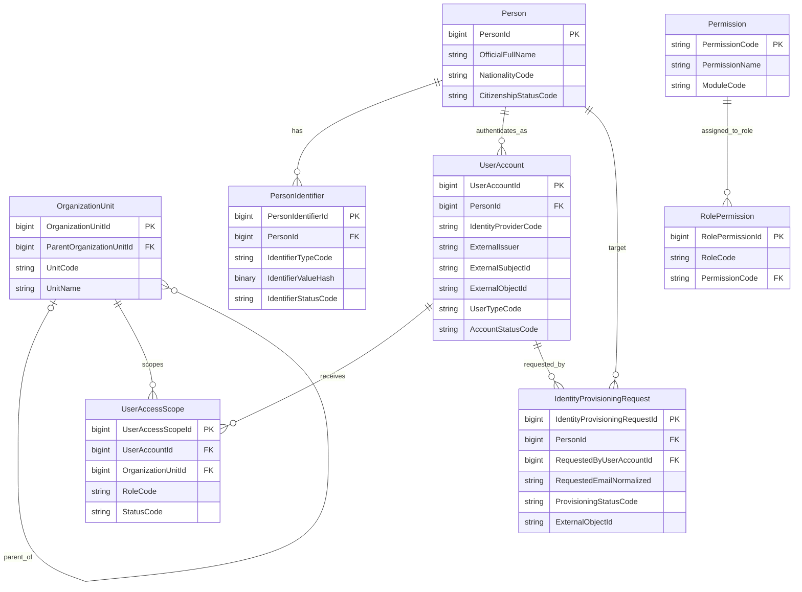

# MOE Authentication and External Identity Provisioning Implementation Plan

## 1. Purpose

This plan extends the current `MOE.StudentFinance` modular-monolith template to support the confirmed login routes:

| Portal | User group | Identity provider |
|---|---|---|
| Admin Portal | MOE and school staff | Microsoft Entra ID workforce tenant |
| e-Service | Singapore citizens | Singpass; MockPass in local development |
| e-Service | Non-Singapore citizens | Microsoft Entra External ID |

Microsoft Entra ID and Singpass prove the external identity. The MOE database remains the source of truth for:

- whether the identity is linked to an MOE `Person`;
- whether the local account is active;
- whether the person is a Student or Account Holder;
- which organization units the Admin can access;
- which permissions the Admin has;
- whether an e-Service user may access MOE functions.

The local `UserAccount` is an identity mapping and application profile. It is not a copy of Entra credentials.

---

## 2. Current template assessment

The template already provides a good foundation:

- one API host;
- one worker host;
- separate Admin and e-Service presentation projects;
- multiple JWT authentication schemes;
- policy-based authorization;
- modular EF Core model contributors;
- one SQL Server database;
- module-owned contracts;
- centralized middleware and CI;
- warnings treated as errors;
- nullable reference types enabled.

The following gaps must be filled before authentication is complete:

1. `UserAccount`, `UserAccessScope`, `Permission`, and `RolePermission` are not implemented.
2. `PersonIdentifier` is not implemented.
3. `IdentityProvisioningRequest` is not implemented.
4. External tokens currently do not become the local claims expected by `HttpCurrentUser`.
5. The current e-Service setup supports only one issuer, but e-Service needs both Singpass and Entra External ID.
6. `ICurrentUser` currently exposes only one organization scope.
7. There is no Microsoft Graph provisioning adapter.
8. There is no Singpass/MockPass identity-resolution flow.
9. There is no first-login activation or provisioning-retry workflow.
10. Authentication and authorization tests are not yet present.

---

## 3. Architectural decision

Keep the current modular monolith.

### Ownership

| Concern | Project/module |
|---|---|
| Authentication scheme registration | `Moe.Infrastructure.Shared` |
| Local identity entities and authorization data | `Moe.Modules.IdentityPlatform` |
| Entra External ID provisioning use cases | `Moe.Modules.IdentityPlatform` |
| Microsoft Graph adapter | `Moe.Modules.IdentityPlatform/Infrastructure` |
| Singpass/MockPass adapter | `Moe.Modules.IdentityPlatform/Infrastructure` |
| Admin authentication endpoints | `Moe.Presentation.Admin` |
| e-Service authentication endpoints | `Moe.Presentation.EService` |
| API host configuration | `Moe.StudentFinance.Api` |
| Audit persistence | future audit/operations implementation |
| Secrets and environment settings | host configuration and secret store |

### Boundary rule

`Moe.Infrastructure.Shared` may validate tokens and register common authorization mechanisms.

It must not contain:

- `UserAccount` business rules;
- Person matching;
- Graph provisioning workflows;
- Student eligibility decisions;
- organization-scope database queries.

Those belong to `IdentityPlatform`.

---

## 4. Target authentication schemes

Replace the two generic scheme names with three explicit external schemes.

```text
AdminEntra
EServiceEntraExternal
EServiceSingpass
```

MockPass uses the `EServiceSingpass` scheme in local development. The provider configuration changes by environment; application policies do not.

### Portal policies

```text
AdminPortal
    accepts: AdminEntra

EServicePortal
    accepts: EServiceEntraExternal, EServiceSingpass
```

### Local authorization claims

After an external token is validated, the backend enriches the principal with local claims:

```text
user_account_id
person_id
portal
organization_unit_id    repeated claim
role                    repeated claim
permission              repeated claim
identity_provider
```

Do not trust organization, role, or permission claims supplied by an external identity provider unless MOE explicitly owns and governs those claims.

---

## 5. Required database model

All timestamps use UTC and use the suffix `Utc`.

Sensitive legal identifiers must not be stored as plain text. The logical identifier value is represented by encrypted, hashed, and masked fields.

### 5.1 `iam.OrganizationUnit`

Purpose: represent MOE HQ, schools, and optional organizational hierarchy.

| Field | SQL Server type | Null | Notes |
|---|---|---:|---|
| `OrganizationUnitId` | `bigint identity` | No | Primary key |
| `ParentOrganizationUnitId` | `bigint` | Yes | Self FK; optional for a flat MVP |
| `UnitCode` | `nvarchar(50)` | No | Unique business code |
| `UnitName` | `nvarchar(200)` | No | Display name |
| `UnitTypeCode` | `varchar(30)` | No | `MOE_HQ`, `SCHOOL`, `DIVISION` |
| `StatusCode` | `varchar(30)` | No | `ACTIVE`, `INACTIVE` |
| `EffectiveFromUtc` | `datetime2` | No | Start of validity |
| `EffectiveToUtc` | `datetime2` | Yes | End of validity |
| `RowVersion` | `rowversion` | No | Optimistic concurrency |

Constraints:

```text
UNIQUE(UnitCode)
ParentOrganizationUnitId must not reference itself
```

---

### 5.2 `iam.UserAccount`

Purpose: map an external authenticated identity to an MOE Person and local access status.

| Field | SQL Server type | Null | Notes |
|---|---|---:|---|
| `UserAccountId` | `bigint identity` | No | Primary key |
| `PersonId` | `bigint` | Yes | Required for e-Service; optional for internal staff until Person records are unified |
| `IdentityProviderCode` | `varchar(40)` | No | `ENTRA_WORKFORCE`, `ENTRA_EXTERNAL`, `SINGPASS` |
| `ExternalTenantId` | `nvarchar(100)` | Yes | Entra tenant ID; null for Singpass when not applicable |
| `ExternalIssuer` | `nvarchar(300)` | No | Validated token issuer |
| `ExternalSubjectId` | `nvarchar(200)` | No | OIDC `sub` |
| `ExternalObjectId` | `nvarchar(100)` | Yes | Entra `oid` where available |
| `LoginEmailNormalized` | `nvarchar(320)` | Yes | Snapshot only; never use as permanent identity key |
| `DisplayNameSnapshot` | `nvarchar(200)` | Yes | Convenience snapshot |
| `UserTypeCode` | `varchar(30)` | No | `INTERNAL`, `ESERVICE` |
| `PortalAccessCode` | `varchar(30)` | No | `ADMIN`, `ESERVICE` |
| `AccountStatusCode` | `varchar(40)` | No | `PENDING_FIRST_LOGIN`, `ACTIVE`, `DISABLED`, `LOCKED`, `REVOKED` |
| `ProvisioningStatusCode` | `varchar(40)` | Yes | `NOT_REQUIRED`, `PENDING`, `COMPLETED`, `FAILED` |
| `FirstLoginAtUtc` | `datetime2` | Yes | First successful local access |
| `LastLoginAtUtc` | `datetime2` | Yes | Last successful local access |
| `CreatedAtUtc` | `datetime2` | No | Creation time |
| `CreatedByUserAccountId` | `bigint` | Yes | Admin/system actor |
| `UpdatedAtUtc` | `datetime2` | No | Last update |
| `RowVersion` | `rowversion` | No | Concurrency |

Required indexes:

```text
UNIQUE(IdentityProviderCode, ExternalIssuer, ExternalSubjectId)
UNIQUE(IdentityProviderCode, ExternalTenantId, ExternalObjectId)
INDEX(PersonId)
INDEX(LoginEmailNormalized)
```

The second unique index is filtered where `ExternalObjectId IS NOT NULL`.

Rules:

- Never store password, password hash, MFA secret, access token, or refresh token.
- Email is a searchable snapshot, not the identity key.
- A disabled local account is denied even if Entra or Singpass authentication succeeds.
- A Person may have more than one `UserAccount`, for example Singpass plus a future identity migration.

---

### 5.3 `iam.UserAccessScope`

Purpose: grant an Admin a role in a specific organization unit for a validity period.

| Field | SQL Server type | Null | Notes |
|---|---|---:|---|
| `UserAccessScopeId` | `bigint identity` | No | Primary key |
| `UserAccountId` | `bigint` | No | FK to `UserAccount` |
| `OrganizationUnitId` | `bigint` | No | FK to `OrganizationUnit` |
| `RoleCode` | `varchar(50)` | No | e.g. `HQ_ADMIN`, `SCHOOL_ADMIN`, `FAS_OFFICER` |
| `StatusCode` | `varchar(30)` | No | `ACTIVE`, `INACTIVE`, `REVOKED` |
| `EffectiveFromUtc` | `datetime2` | No | Start |
| `EffectiveToUtc` | `datetime2` | Yes | End |
| `CreatedAtUtc` | `datetime2` | No | Audit time |
| `CreatedByUserAccountId` | `bigint` | Yes | Actor |
| `RowVersion` | `rowversion` | No | Concurrency |

Constraint:

```text
UNIQUE(UserAccountId, OrganizationUnitId, RoleCode, EffectiveFromUtc)
```

---

### 5.4 `iam.Permission`

Purpose: define action-level permissions without scattering role checks across controllers.

| Field | SQL Server type | Null |
|---|---|---:|
| `PermissionCode` | `varchar(100)` | No, PK |
| `PermissionName` | `nvarchar(200)` | No |
| `ModuleCode` | `varchar(50)` | No |
| `ActionCode` | `varchar(30)` | No |
| `ResourceCode` | `varchar(50)` | No |
| `StatusCode` | `varchar(30)` | No |

Initial seed values:

```text
ACCOUNTS_VIEW
ACCOUNTS_MANAGE
EXTERNAL_ACCOUNTS_PROVISION
ACCESS_SCOPE_MANAGE
TOPUPS_MANAGE
COURSES_MANAGE
FAS_REVIEW
PAYMENT_EXCEPTIONS_REVIEW
```

---

### 5.5 `iam.RolePermission`

Purpose: map a `RoleCode` to permissions.

| Field | SQL Server type | Null |
|---|---|---:|
| `RolePermissionId` | `bigint identity` | No, PK |
| `RoleCode` | `varchar(50)` | No |
| `PermissionCode` | `varchar(100)` | No |
| `StatusCode` | `varchar(30)` | No |
| `EffectiveFromUtc` | `datetime2` | No |
| `EffectiveToUtc` | `datetime2` | Yes |
| `RowVersion` | `rowversion` | No |

Constraint:

```text
UNIQUE(RoleCode, PermissionCode, EffectiveFromUtc)
```

---

### 5.6 `person.PersonIdentifier`

Purpose: link multiple legal and external identifiers to one Person.

| Field | SQL Server type | Null | Notes |
|---|---|---:|---|
| `PersonIdentifierId` | `bigint identity` | No | Primary key |
| `PersonId` | `bigint` | No | FK to Person |
| `IdentifierTypeCode` | `varchar(50)` | No | `NRIC`, `FIN`, `PASSPORT`, `SINGPASS_SUBJECT`, `UPSTREAM_CITIZEN_ID` |
| `IdentifierValueEncrypted` | `varbinary(max)` | Yes | Encrypted value when retrieval is required |
| `IdentifierValueHash` | `binary(32)` | No | Deterministic SHA-256/HMAC lookup value |
| `IdentifierMasked` | `nvarchar(100)` | Yes | Safe display value |
| `IssuingCountryCode` | `char(2)` | Yes | ISO country code |
| `IssuedByAuthority` | `nvarchar(150)` | Yes | Issuing body |
| `IdentifierStatusCode` | `varchar(30)` | No | `ACTIVE`, `EXPIRED`, `REPLACED`, `INVALID` |
| `IsPrimary` | `bit` | No | Current primary identifier |
| `EffectiveFrom` | `date` | Yes | Validity start |
| `EffectiveTo` | `date` | Yes | Validity end |
| `SourceSystemCode` | `varchar(50)` | No | `SINGPASS`, `SCHOOL_IMPORT`, `UPSTREAM_CITIZEN`, `ADMIN_MANUAL` |
| `CreatedAtUtc` | `datetime2` | No | Creation |
| `UpdatedAtUtc` | `datetime2` | No | Update |
| `RowVersion` | `rowversion` | No | Concurrency |

Constraints:

```text
UNIQUE(IdentifierTypeCode, IdentifierValueHash)
Only one active primary identifier per Person and IdentifierTypeCode
```

---

### 5.7 `iam.IdentityProvisioningRequest`

Purpose: track Admin-initiated creation of a non-citizen Entra External ID account.

| Field | SQL Server type | Null | Notes |
|---|---|---:|---|
| `IdentityProvisioningRequestId` | `bigint identity` | No | Primary key |
| `PersonId` | `bigint` | No | Target Person |
| `IdentityProviderCode` | `varchar(40)` | No | `ENTRA_EXTERNAL` |
| `RequestedEmailNormalized` | `nvarchar(320)` | No | Sign-in email |
| `DisplayNameSnapshot` | `nvarchar(200)` | No | Name sent to provider |
| `ProvisioningStatusCode` | `varchar(40)` | No | See status list below |
| `IdempotencyKey` | `nvarchar(100)` | No | Unique retry key |
| `ExternalTenantId` | `nvarchar(100)` | Yes | Returned/target tenant |
| `ExternalObjectId` | `nvarchar(100)` | Yes | Returned Entra object ID |
| `ExternalSubjectId` | `nvarchar(200)` | Yes | Subject when available |
| `RequestedByUserAccountId` | `bigint` | No | Admin actor |
| `RequestedAtUtc` | `datetime2` | No | Request time |
| `ProcessingStartedAtUtc` | `datetime2` | Yes | Start |
| `CompletedAtUtc` | `datetime2` | Yes | Success |
| `FailureCode` | `varchar(100)` | Yes | Stable machine-readable error |
| `FailureReason` | `nvarchar(1000)` | Yes | Sanitized support text |
| `RetryCount` | `int` | No | Starts at zero |
| `CorrelationId` | `nvarchar(100)` | No | Traceability |
| `RowVersion` | `rowversion` | No | Concurrency |

Statuses:

```text
PENDING
PROCESSING
COMPLETED
FAILED_RETRYABLE
FAILED_MANUAL_REVIEW
CANCELLED
```

Constraints:

```text
UNIQUE(IdempotencyKey)
filtered UNIQUE(PersonId, IdentityProviderCode)
where ProvisioningStatusCode in ('PENDING', 'PROCESSING', 'COMPLETED')
```

---

## 6. Entity relationships



---

## 7. Required source changes

### 7.1 Shared security

Update:

```text
src/Shared/Moe.Infrastructure.Shared/
    Configuration/Options.cs
    Security/SecurityConstants.cs
    DependencyInjection.cs
```

Add:

```text
Security/LocalIdentityClaimNames.cs
Security/PortalAuthorizationRequirements.cs
Security/PortalAuthorizationHandlers.cs
```

Do not put database queries in `Moe.Infrastructure.Shared`.

### 7.2 IdentityPlatform module

Add:

```text
src/Modules/IdentityPlatform/Moe.Modules.IdentityPlatform/
    Domain/
        Iam/
            OrganizationUnit.cs
            UserAccount.cs
            UserAccessScope.cs
            Permission.cs
            RolePermission.cs
            IdentityProvisioningRequest.cs
            UserAccountStatusCodes.cs
            IdentityProviderCodes.cs
            ProvisioningStatusCodes.cs
        People/
            PersonIdentifier.cs

    Application/
        Authentication/
            ResolveLocalIdentity/
            RecordSuccessfulLogin/
        ExternalProvisioning/
            ProvisionExternalUser/
            RetryExternalProvisioning/
            DisableExternalUser/
        Access/
            GetEffectiveAccess/
            AssignAccessScope/
            RevokeAccessScope/

    Infrastructure/
        Authentication/
            LocalIdentityResolver.cs
            LocalClaimsTransformation.cs
        EntraExternal/
            IEntraExternalDirectoryClient.cs
            EntraExternalDirectoryClient.cs
            EntraExternalOptions.cs
        Singpass/
            ISingpassIdentityClient.cs
            MockPassIdentityClient.cs
            SingpassIdentityClient.cs
            SingpassOptions.cs
        Persistence/
            OrganizationUnitConfiguration.cs
            UserAccountConfiguration.cs
            UserAccessScopeConfiguration.cs
            PermissionConfiguration.cs
            RolePermissionConfiguration.cs
            IdentityProvisioningRequestConfiguration.cs
            PersonIdentifierConfiguration.cs
```

### 7.3 Contracts

Add only public, cross-module contracts:

```text
Moe.Modules.IdentityPlatform.Contracts/
    Authentication/
        LocalIdentitySummary.cs
        ILocalIdentityDirectory.cs
    People/
        PersonIdentifierSummary.cs
    Students/
        EServiceEligibilitySummary.cs
```

Do not expose EF entities or DbContext.

### 7.4 Admin presentation

Add:

```text
Moe.Presentation.Admin/Controllers/
    ExternalIdentityProvisioningController.cs
    UserAccessScopesController.cs
```

Endpoints:

```text
POST /api/admin/v1/people/{personId}/external-identities/entra
GET  /api/admin/v1/identity-provisioning-requests/{requestId}
POST /api/admin/v1/identity-provisioning-requests/{requestId}/retry
POST /api/admin/v1/user-accounts/{userAccountId}/disable
POST /api/admin/v1/user-accounts/{userAccountId}/access-scopes
DELETE /api/admin/v1/user-access-scopes/{scopeId}
```

### 7.5 e-Service presentation

Add:

```text
Moe.Presentation.EService/Controllers/
    EServiceIdentityController.cs
```

Useful endpoint:

```text
GET /api/eservice/v1/me
```

It returns local MOE profile/access information after authentication. It must not return raw token claims or sensitive identifiers.

For a server-managed Singpass authorization-code flow, add non-API callback routes:

```text
GET /auth/eservice/singpass/start
GET /auth/eservice/singpass/callback
POST /auth/eservice/logout
```

### 7.6 Database model contributor

Update `IdentityPlatformModelConfiguration` to apply each mapping explicitly.

Keep the contributor list alphabetized.

---

## 8. Authentication configuration

Replace the current generic configuration with explicit provider sections.

```json
{
  "Authentication": {
    "AdminEntra": {
      "Authority": "https://login.microsoftonline.com/<workforce-tenant-id>/v2.0",
      "Audience": "api://<admin-api-client-id>",
      "AllowedTenantId": "<workforce-tenant-id>",
      "RequireHttpsMetadata": true
    },
    "EServiceEntraExternal": {
      "Authority": "https://<external-tenant-domain>/<external-tenant-id>/v2.0",
      "Audience": "api://<eservice-api-client-id>",
      "AllowedTenantId": "<external-tenant-id>",
      "RequireHttpsMetadata": true
    },
    "EServiceSingpass": {
      "Mode": "MockPass",
      "DiscoveryEndpoint": "http://localhost:5156/singpass/v3/fapi/.well-known/openid-configuration",
      "ClientId": "moe-eservice-local",
      "Audience": "moe-eservice-api",
      "RequireHttpsMetadata": false
    }
  },
  "IdentityProvisioning": {
    "Provider": "EntraExternal",
    "TenantId": "<external-tenant-id>",
    "ClientId": "<provisioning-app-client-id>",
    "CredentialMode": "ManagedIdentity",
    "ExternalTenantDomain": "<external-tenant-domain>",
    "GraphBaseUrl": "https://graph.microsoft.com/v1.0"
  }
}
```

Rules:

- `appsettings.json` contains placeholders and non-secret defaults only.
- local secrets use .NET user-secrets;
- CI/UAT/production secrets use the platform secret store;
- production uses managed identity or certificate authentication;
- never commit client secrets, private keys, temporary passwords, tokens, or identifier-encryption keys.

---

## 9. Update authentication constants

Recommended names:

```csharp
public static class AuthenticationSchemes
{
    public const string AdminEntra = "AdminEntra";
    public const string EServiceEntraExternal = "EServiceEntraExternal";
    public const string EServiceSingpass = "EServiceSingpass";
}
```

Policies:

```csharp
public static class AuthorizationPolicies
{
    public const string AdminPortal = "AdminPortal";
    public const string EServicePortal = "EServicePortal";

    public const string ManageAccounts = "ManageAccounts";
    public const string ProvisionExternalAccounts = "ProvisionExternalAccounts";
    public const string ManageAccessScopes = "ManageAccessScopes";
}
```

The e-Service policy lists both e-Service schemes. The Admin policy lists only the workforce Entra scheme.

---

## 10. Local claims resolution

External tokens do not contain MOE database identifiers. The backend must resolve them.

### Resolution input

```text
Authentication scheme
Token issuer
Token subject
Tenant ID
Entra object ID when present
```

### Resolution output

```text
UserAccountId
PersonId
Portal
AccountStatus
Organization scopes
Roles
Permissions
```

### Processing rules

1. Validate the external token completely.
2. Normalize the issuer before lookup.
3. Find `UserAccount` by provider + issuer + subject.
4. For Entra, also verify tenant and object ID when available.
5. Reject missing, disabled, locked, revoked, or expired local accounts.
6. Load active access scopes.
7. Resolve permissions from active role-permission mappings.
8. Add local claims to the current principal.
9. Update `LastLoginAtUtc` using a throttled operation; do not write on every API request.
10. Never auto-create a non-citizen account during login.

### `ICurrentUser` change

Replace the single organization ID with a collection.

```csharp
public interface ICurrentUser
{
    long? UserAccountId { get; }

    long? PersonId { get; }

    IReadOnlySet<long> OrganizationUnitIds { get; }

    IReadOnlySet<string> Roles { get; }

    IReadOnlySet<string> Permissions { get; }

    string Portal { get; }

    bool IsAuthenticated { get; }

    bool HasPermission(string permission);
}
```

This prevents the authorization model from silently assuming one scope per Admin.

---

## 11. Admin Entra login flow

```text
Admin browser
    -> Entra workforce login
    -> Admin access token
    -> MOE Admin API
    -> AdminEntra token validation
    -> local UserAccount lookup
    -> scope/permission lookup
    -> Admin endpoint authorization
```

Rules:

- Internal users are pre-provisioned or imported.
- Successful Entra authentication does not create an Admin automatically.
- The token tenant must equal the configured workforce tenant.
- The `UserAccount` must be `ACTIVE`.
- The requested action must be allowed by local permission.
- The data query must be restricted to active organization scopes.

Exit criteria:

- unprovisioned Entra user receives 403;
- disabled user receives 403;
- School A user cannot access School B data;
- HQ user access follows configured scopes and permissions.

---

## 12. Non-citizen Entra External ID provisioning flow

### Step 1 — validate local Person

Admin selects an existing Person/Student.

Checks:

```text
Person exists and is active
Student exists or the business rule allows e-Service access
citizenship route is ENTRA_EXTERNAL
verified email is present
no completed active Entra External mapping exists
Admin has EXTERNAL_ACCOUNTS_PROVISION permission
```

### Step 2 — create provisioning request

Create `IdentityProvisioningRequest` first.

```text
Status = PENDING
IdempotencyKey = client-provided stable value
```

Commit before calling the provider, or use an outbox/job if provisioning is asynchronous.

### Step 3 — call Microsoft Graph adapter

The application layer calls:

```csharp
public interface IEntraExternalDirectoryClient
{
    Task<ExternalDirectoryUserResult> CreateUserAsync(
        CreateExternalDirectoryUserRequest request,
        CancellationToken cancellationToken);

    Task<ExternalDirectoryUserResult?> FindByEmailAsync(
        string normalizedEmail,
        CancellationToken cancellationToken);

    Task DisableUserAsync(
        string externalObjectId,
        CancellationToken cancellationToken);
}
```

The application layer must not know Graph SDK classes.

### Step 4 — handle success

In one SQL transaction:

```text
create UserAccount
mark provisioning request COMPLETED
store tenant/object/subject identifiers
write audit record
```

Initial local status:

```text
PENDING_FIRST_LOGIN
```

### Step 5 — handle timeout or uncertainty

Do not blindly create another user.

Retry logic:

1. query External ID by normalized email;
2. if exactly one matching user exists, link it;
3. if no user exists, retry creation with the same idempotency context;
4. if multiple or conflicting users exist, mark `FAILED_MANUAL_REVIEW`;
5. create an exception work item when operations tables are available.

### Step 6 — first login

After successful external authentication:

```text
PENDING_FIRST_LOGIN -> ACTIVE
FirstLoginAtUtc = now
LastLoginAtUtc = now
```

---

## 13. Non-citizen e-Service login flow

```text
User selects "MOE account"
    -> Entra External ID
    -> receives access token
    -> EServiceEntraExternal validation
    -> local UserAccount lookup
    -> Person and Student eligibility check
    -> e-Service access
```

Local eligibility rules:

- active `UserAccount`;
- active `Person`;
- Student or Account Holder condition satisfied;
- no revoked access condition;
- portal access is `ESERVICE`.

The API must not infer access only from nationality or email.

---

## 14. Citizen MockPass/Singpass flow

### Development

```text
e-Service
    -> MockPass
    -> validate MockPass response
    -> resolve PersonIdentifier
    -> create/link Singpass UserAccount when allowed
    -> local eligibility check
```

### Production

Use the same application interface with a production Singpass adapter.

```csharp
public interface ISingpassIdentityClient
{
    Task<SingpassAuthorizationStart> CreateAuthorizationAsync(
        CancellationToken cancellationToken);

    Task<SingpassIdentityResult> CompleteAuthorizationAsync(
        SingpassCallback callback,
        CancellationToken cancellationToken);
}
```

MockPass is an adapter for development, not a separate business flow.

### Matching rules

Preferred matching order:

1. existing `UserAccount` by issuer + subject;
2. active `PersonIdentifier` of type `SINGPASS_SUBJECT`;
3. verified government identifier hash when available and approved;
4. otherwise deny and send to manual identity resolution.

The login flow may create the local `UserAccount` mapping after a trusted Person match. It must not create:

- a new Person;
- an Education Account;
- a Student;
- an enrollment.

Those are separate business workflows.

---

## 15. Authorization design

### Authentication answers

```text
Who is the caller?
```

### Local authorization answers

```text
Can the caller use this portal?
Can the caller perform this action?
Can the caller access this organization unit?
Can the e-Service caller access this Person's data?
```

### Admin checks

Every Admin use case checks:

1. portal policy;
2. permission;
3. organization scope;
4. target entity ownership.

### e-Service checks

Every personal endpoint derives the Person from `ICurrentUser.PersonId`.

Do not accept arbitrary `PersonId` from the client for endpoints such as:

```text
GET /api/eservice/v1/me
GET /api/eservice/v1/my-education-account
GET /api/eservice/v1/my-bills
```

This prevents horizontal privilege escalation.

---

## 16. Phase-by-phase implementation

## Phase 0 — Baseline cleanup

**Goal:** make the template consistent before adding authentication behavior.

Tasks:

- remove unused references from module projects to `Moe.Infrastructure.Shared`;
- keep infrastructure registration in the host;
- add the expanded coding conventions from this document;
- make braces mandatory;
- split the current multi-type files into one principal type per file;
- standardize all timestamps to `AtUtc`;
- add architecture tests or project-reference review;
- nominate one migration owner.

Deliverables:

```text
clean build
all tests green
no new warnings
dependency diagram reviewed
```

---

## Phase 1 — IAM and identifier persistence

**Goal:** create all local source-of-truth tables.

Implement:

```text
OrganizationUnit
UserAccount
UserAccessScope
Permission
RolePermission
IdentityProvisioningRequest
PersonIdentifier
```

Tasks:

- domain entities;
- code/status constants;
- EF mappings;
- indexes and filtered indexes;
- model contributor registration;
- seed baseline permissions;
- migration;
- migration SQL review;
- repository/query abstractions internal to IdentityPlatform.

Tests:

- duplicate external identity rejected;
- duplicate active provisioning request rejected;
- one identifier cannot belong to two people;
- expired scope is ignored;
- revoked permission is ignored;
- row-version conflict returns a controlled error.

Exit criterion:

```text
database can represent all three login routes without storing credentials
```

---

## Phase 2 — Local identity resolver

**Goal:** convert validated external identities into MOE local context.

Implement:

```text
ILocalIdentityResolver
LocalIdentityResolver
LocalClaimsTransformation
ICurrentUser organization/role/permission collections
```

Tasks:

- external claim normalization;
- issuer/subject lookup;
- status checks;
- effective-date filters;
- scope and permission expansion;
- local claim creation;
- sanitized authentication failure handling;
- short-lived cache with explicit invalidation strategy.

Tests:

- active mapping resolves;
- disabled mapping fails;
- wrong tenant fails;
- wrong portal fails;
- multiple organization scopes are preserved;
- permission effective dates are respected.

Exit criterion:

```text
existing JWT schemes can authorize against local MOE data
```

---

## Phase 3 — Admin workforce Entra

**Goal:** secure the Admin Portal using workforce Entra plus local authorization.

Tasks:

- add `AdminEntra` configuration;
- validate tenant, issuer, audience, lifetime, and signature;
- use only local permissions/scopes for business access;
- implement Admin `GET /me`;
- implement permission and school-scope handlers;
- seed test Admin accounts;
- update Swagger authentication setup for development/UAT.

Tests:

- valid Entra token + active local account succeeds;
- valid Entra token + no local account returns 403;
- School A access to School B returns 403;
- e-Service token cannot call Admin route;
- expired token returns 401;
- inactive local scope returns 403.

Exit criterion:

```text
Admin happy path and school isolation are demonstrable
```

---

## Phase 4 — External ID provisioning

**Goal:** allow authorized Admins to provision non-citizen e-Service identities.

Tasks:

- add provisioning command, validator, handler, and response;
- add `IEntraExternalDirectoryClient`;
- add Graph adapter;
- add admin controller;
- implement idempotency;
- implement timeout recovery;
- link successful external identity to Person;
- add disable account command;
- record audit events;
- add retry endpoint.

Recommended use-case folders:

```text
Application/ExternalProvisioning/ProvisionExternalUser/
Application/ExternalProvisioning/RetryExternalProvisioning/
Application/ExternalProvisioning/DisableExternalUser/
```

Exit criterion:

```text
Admin can provision once, retry safely, and see a clear status
```

---

## Phase 5 — Non-citizen e-Service authentication

**Goal:** allow provisioned external users to access e-Service.

Tasks:

- add `EServiceEntraExternal` scheme;
- add both e-Service schemes to the portal policy;
- map Entra External ID token to local UserAccount;
- activate `PENDING_FIRST_LOGIN`;
- implement `GET /api/eservice/v1/me`;
- enforce Person/Student eligibility;
- add disabled-user behavior;
- add account-status display for support.

Exit criterion:

```text
a provisioned foreign Student can log in and an unprovisioned user cannot
```

---

## Phase 6 — MockPass/Singpass adapter

**Goal:** support citizen authentication without coupling application code to MockPass.

Tasks:

- implement `ISingpassIdentityClient`;
- implement MockPass adapter;
- add state, nonce, replay, and callback storage;
- implement PersonIdentifier matching;
- implement safe first-time local mapping;
- add local environment configuration;
- add production adapter placeholder;
- ensure MockPass is impossible to enable in Production.

Tests:

- valid MockPass identity resolves;
- unknown identity is denied;
- replayed callback is denied;
- mismatched state is denied;
- disabled Person is denied;
- login never creates an Education Account automatically.

Exit criterion:

```text
citizen and non-citizen e-Service users reach the same local authorization model
```

---

## Phase 7 — Security hardening and operations

Tasks:

- rate-limit authentication and provisioning endpoints;
- sanitize logs;
- protect identifier keys;
- configure secret rotation;
- add correlation IDs;
- add audit events;
- add operational exception handling;
- add account disable/revoke flow;
- add permission-change cache invalidation;
- run dependency and secret scanning;
- document support procedures.

Required audit actions:

```text
EXTERNAL_ACCOUNT_PROVISION_REQUESTED
EXTERNAL_ACCOUNT_PROVISION_COMPLETED
EXTERNAL_ACCOUNT_PROVISION_FAILED
USER_ACCOUNT_ACTIVATED
USER_ACCOUNT_DISABLED
ACCESS_SCOPE_ASSIGNED
ACCESS_SCOPE_REVOKED
LOGIN_ACCESS_DENIED
```

Do not log raw tokens, temporary passwords, full legal identifiers, or Graph credentials.

---

## Phase 8 — UAT readiness

Deliverables:

- UAT Entra workforce app registration;
- UAT External ID tenant/app registration;
- UAT provisioning service identity;
- MockPass or Singpass staging decision;
- seeded Admin roles/scopes;
- seeded citizen and non-citizen test persons;
- test support runbook;
- migration script;
- rollback script;
- environment configuration checklist;
- end-to-end test report.

Exit criterion:

```text
QA can run all acceptance scenarios without developer database edits
```

---

## 17. Sprint placement

### Sprint 1

```text
Phase 0
Phase 1
Phase 2
Phase 3
```

Demo:

```text
Admin signs in with Entra
local UserAccount is resolved
school scope and permission are enforced
```

### Sprint 2

```text
Phase 4
Phase 5
Phase 6 development flow
```

Demo:

```text
Admin provisions a non-citizen
non-citizen signs into e-Service
citizen signs in through MockPass
both resolve to local Person
```

### Sprint 3

```text
Phase 7
Phase 8
full regression and UAT fixes
```

---

## 18. Code conventions

## 18.1 Project and module rules

- Group by business module first, technical layer second.
- Only IdentityPlatform writes IAM and PersonIdentifier tables.
- Presentation projects do not contain business logic.
- Shared projects contain mechanisms only.
- No generic repository.
- No module references another module implementation.
- Cross-module use goes through `.Contracts`.
- Domain entities and EF configurations are `internal` unless a technical reason requires otherwise.
- Public types are minimized.

## 18.2 File rules

Use one main public type per file.

Preferred:

```text
ProvisionExternalUserCommand.cs
ProvisionExternalUserValidator.cs
ProvisionExternalUserHandler.cs
ProvisionExternalUserResponse.cs
```

Avoid a single file containing command, response, validator, handler, status constants, and errors.

Small private records may remain near the implementation that owns them.

## 18.3 Naming

Use explicit names.

Preferred:

```text
IdentityProvisioningRequest
ExternalDirectoryUserResult
RequestedByUserAccountId
ProvisioningStatusCode
```

Avoid:

```text
Req
Info
Data
Manager
Helper
Util
Proc
```

Conventions:

```text
Async methods end in Async.
UTC timestamps end in Utc.
Boolean names start with Is, Has, Can, or Should.
Collection names are plural.
IDs use the full entity name.
```

## 18.4 Method layout

Every application handler uses the same visible blocks:

```text
1. Validate actor and authorization
2. Load required state
3. Check business rules
4. Execute domain action or provider call
5. Persist
6. Return result
```

Separate each block with one blank line.

Example:

```csharp
public async Task<Result<ProvisionExternalUserResponse>> HandleAsync(
    ProvisionExternalUserCommand command,
    CancellationToken cancellationToken)
{
    long? actorId = currentUser.UserAccountId;

    if (actorId is null)
    {
        return Result<ProvisionExternalUserResponse>.Failure(
            IdentityErrors.AuthenticatedAdminRequired);
    }


    Person? person = await people.FindAsync(
        command.PersonId,
        cancellationToken);

    if (person is null)
    {
        return Result<ProvisionExternalUserResponse>.Failure(
            IdentityErrors.PersonNotFound);
    }


    bool alreadyProvisioned = await userAccounts.ExistsAsync(
        command.PersonId,
        IdentityProviderCodes.EntraExternal,
        cancellationToken);

    if (alreadyProvisioned)
    {
        return Result<ProvisionExternalUserResponse>.Failure(
            IdentityErrors.ExternalAccountAlreadyExists);
    }


    IdentityProvisioningRequest request =
        IdentityProvisioningRequest.Create(
            command.PersonId,
            command.Email,
            actorId.Value,
            command.IdempotencyKey,
            clock.UtcNow);

    db.Add(request);

    await unitOfWork.SaveChangesAsync(cancellationToken);


    return Result<ProvisionExternalUserResponse>.Success(
        new ProvisionExternalUserResponse(
            request.Id,
            request.ProvisioningStatusCode));
}
```

Use one blank line between logical blocks. Do not use multiple blank lines inside a single block.

## 18.5 Guard clauses

Prefer early return.

Preferred:

```csharp
if (person is null)
{
    return Result<LocalIdentity>.Failure(IdentityErrors.PersonNotFound);
}

if (!person.IsActive)
{
    return Result<LocalIdentity>.Failure(IdentityErrors.PersonInactive);
}
```

Avoid deeply nested `if` statements.

## 18.6 Braces

Braces are mandatory for:

```text
if
else
for
foreach
while
using
lock
```

Even for one-line bodies.

## 18.7 Domain behavior

Entities enforce invariants.

Application handlers coordinate use cases.

Infrastructure performs external I/O.

Example:

```text
UserAccount.ActivateFirstLogin(...)
IdentityProvisioningRequest.MarkProcessing(...)
IdentityProvisioningRequest.Complete(...)
IdentityProvisioningRequest.FailRetryable(...)
```

Avoid public setters and anemic status manipulation from controllers.

## 18.8 Error handling

Use `Result<T>` for expected business failures:

```text
person not found
account disabled
duplicate provisioning
scope expired
permission missing
```

Use exceptions for unexpected technical failures:

```text
database unavailable
Graph response cannot be parsed
cryptographic provider failure
```

Middleware converts unexpected exceptions to a safe `ProblemDetails` response.

Never return raw provider error payloads to the client.

## 18.9 Validation

Use FluentValidation for request shape:

```text
required values
length
email format
idempotency-key format
positive IDs
```

Use domain/application rules for:

```text
citizenship route
duplicate identity
admin permission
active Person
Student eligibility
provider status transitions
```

Do not put business decisions only in FluentValidation.

## 18.10 SOLID application

### Single Responsibility

One handler implements one use case.

```text
ProvisionExternalUser
RetryExternalProvisioning
DisableExternalUser
```

Do not create one large `IdentityService` with many unrelated methods.

### Open/Closed

Provider behavior is behind interfaces:

```text
IEntraExternalDirectoryClient
ISingpassIdentityClient
```

MockPass and production Singpass are separate adapters.

### Liskov Substitution

All provider implementations return the same contract semantics.

A mock must not bypass validation rules that production requires.

### Interface Segregation

Prefer focused interfaces:

```text
ILocalIdentityDirectory
IExternalIdentityProvisioner
IAccessScopeReader
```

Avoid one `IIdentityService` with twenty methods.

### Dependency Inversion

Application code depends on interfaces.

Provider SDK and HTTP classes remain in Infrastructure.

## 18.11 Comments

Comments explain why, risk, or external constraints.

Good:

```csharp
// The provider may have created the user before the request timed out.
// Search before retrying to prevent duplicate external identities.
```

Avoid:

```csharp
// Check if person is null.
```

## 18.12 Logging

Use structured messages:

```csharp
logger.LogInformation(
    "External identity provisioning completed for PersonId {PersonId}, RequestId {RequestId}, CorrelationId {CorrelationId}",
    request.PersonId,
    request.Id,
    request.CorrelationId);
```

Never include:

```text
access tokens
refresh tokens
temporary passwords
raw NRIC/FIN/passport
full provider payloads
client secrets
```

## 18.13 Controller rules

Controllers:

- bind HTTP input;
- call validator;
- call one handler;
- translate result to HTTP;
- contain no EF queries;
- contain no provider calls;
- contain no status-transition logic.

Keep controller methods under approximately 25–35 readable lines.

## 18.14 Line length and formatting

Recommended:

```text
Maximum normal line length: 120
Indentation: four spaces
File-scoped namespaces
One statement per line
One blank line between logical blocks
No trailing whitespace
Final newline required
```

Run:

```text
dotnet format --verify-no-changes
```

in CI.

---

## 19. Recommended `.editorconfig` additions

```ini
[*.cs]
csharp_prefer_braces = true:error
csharp_style_namespace_declarations = file_scoped:error
dotnet_diagnostic.IDE0055.severity = error
dotnet_diagnostic.IDE0005.severity = error
dotnet_style_readonly_field = true:warning
csharp_style_prefer_primary_constructors = false:silent
csharp_style_expression_bodied_methods = false:silent
csharp_style_expression_bodied_properties = when_on_single_line:suggestion
```

Primary constructors may be used for small dependency-injection classes only when the team agrees. Do not mix styles randomly.

---

## 20. Required test plan

### Unit tests

```text
UserAccount activation transitions
IdentityProvisioningRequest status transitions
PersonIdentifier uniqueness rules
scope effective-date rules
permission effective-date rules
citizenship login-route decision
```

### Module integration tests

```text
external identity lookup
filtered unique indexes
claims enrichment
school-scope query filtering
provisioning idempotency
Graph timeout recovery
first-login activation
```

### API tests

```text
Admin route accepts AdminEntra only
e-Service route accepts External ID and Singpass schemes
Admin token cannot call e-Service personal endpoint
e-Service token cannot call Admin endpoint
unprovisioned user gets 403
disabled local user gets 403
```

### End-to-end UAT scenarios

| Scenario | Expected result |
|---|---|
| Provisioned Admin with active school scope | Can access only their school |
| Valid Entra staff token without local account | 403 |
| Foreign Student provisioned once | One Entra identity and one local mapping |
| Provisioning request retried | No duplicate user |
| Foreign user first login | Local account becomes active |
| Unknown External ID user | 403 |
| Known MockPass citizen with valid Person | e-Service access |
| Unknown MockPass citizen | Access denied/manual resolution |
| Disabled Person | Access denied |
| Expired access scope | Admin action denied |
| Revoked permission | Action denied |
| Raw PersonId changed in e-Service URL/body | Does not expose another person's data |

---

## 21. Pull-request checklist

Every authentication PR must answer:

```text
Which module owns the change?
Does it add or modify a public contract?
Does it alter a database constraint?
Are secrets or identifiers logged?
Is the failure idempotent?
Is authorization enforced in the backend?
Does it support cancellation?
Are UTC timestamps used?
Are unit and integration tests included?
Does it preserve portal separation?
```

Reviewers reject PRs that:

- query another module’s table directly;
- expose provider SDK types from Application;
- add business code to controllers;
- store credentials locally;
- use email as the permanent external identity key;
- create Person or Education Account during login;
- omit idempotency for provisioning;
- rely only on UI authorization.

---

## 22. Team ownership

| Work area | Primary | Reviewer |
|---|---|---|
| Authentication schemes and policies | Dev 1 | Tech lead |
| IAM entities, EF mappings, claims resolution | Dev 1 | Dev 2 |
| PersonIdentifier and Person matching | Dev 2 | Dev 1 |
| Graph provisioning adapter | Dev 1 | Dev 2 |
| Admin provisioning UI/API | Dev 1 | QA 2 |
| e-Service identity flow | Dev 2 | Dev 1 |
| MockPass test environment | Dev 2 | QA 2 |
| Database migration | Sprint migration owner | Dev 1 + Dev 2 |
| Security tests | QA 2 | QA 1 |
| Regression across financial modules | QA 1 | QA 2 |

Only the nominated migration owner generates and commits the migration. Other developers contribute entity configurations before the migration cut-off.

---

## 23. Definition of done

The flow is complete only when:

- three authentication schemes are configured;
- tokens are validated by issuer, audience, signature, lifetime, and tenant;
- all external identities resolve to a local `UserAccount`;
- local status can deny an externally authenticated identity;
- organization scopes and permissions are enforced server-side;
- an Admin can safely provision a foreign Student;
- retries do not create duplicate Entra users;
- citizens can use MockPass in local development;
- no credentials or raw legal identifiers are stored or logged;
- all migrations are reviewed;
- unit, integration, API, and UAT tests pass;
- support staff can identify provisioning failures using correlation IDs;
- the UAT environment is reproducible from deployment configuration.
