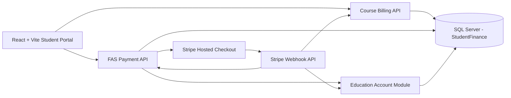
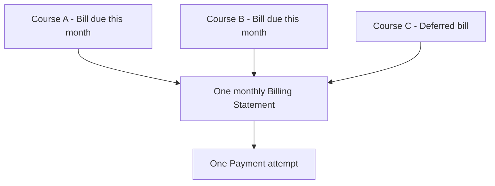
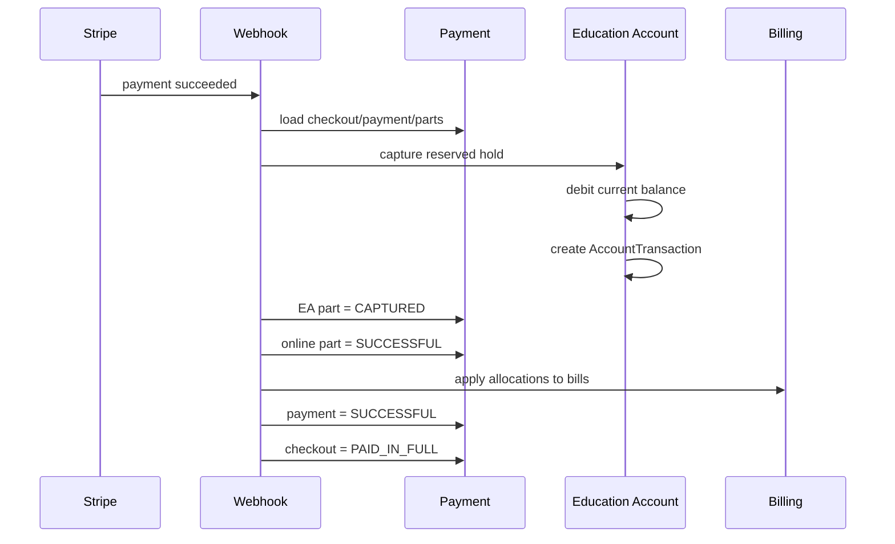
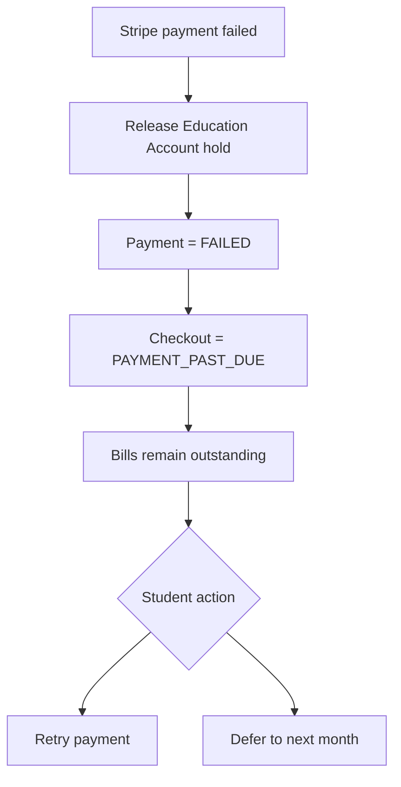

# Course Join and Payment Business Flow

## 1. Mục đích

Tài liệu này mô tả business và logic kỹ thuật hiện tại của luồng:

1. Student xem course.
2. Student chọn payment plan và join course.
3. Backend tạo enrollment và các bill tương ứng.
4. Trang Payment gom toàn bộ bill đến hạn trong tháng.
5. Hệ thống dùng Education Account trước, Stripe cho phần còn thiếu.
6. Backend xử lý Stripe webhook, cập nhật payment, bill, enrollment và số dư.
7. Student có thể retry hoặc defer khi thanh toán thất bại.

Phạm vi bao gồm:

- Frontend React + Vite:
  `aglie-final-moe-frontend`.
- Backend ASP.NET Core / .NET 10:
  `agile-final-moe-backend`.
- SQL Server database:
  `StudentFinance`.
- Stripe Test Mode với Stripe Hosted Checkout.

> Lưu ý: tài liệu mô tả đúng implementation hiện tại. Một số ý tưởng ban
> đầu như trả theo quý/năm hoặc Stripe Subscription tự động chưa nằm trong
> luồng Payment chính hiện tại.

---

## 2. Business rules tổng quát

### 2.1 Student và course

Student chỉ được join course khi:

- Đã đăng nhập vào E-Service Portal.
- Login account liên kết với một `PersonId` hợp lệ.
- Người dùng có role student.
- Course tồn tại.
- Course đang `PUBLISHED`.
- Course không bị disabled.
- Thời điểm hiện tại nằm trong khoảng:
  `EnrollmentOpenAtUtc <= now <= EnrollmentCloseAtUtc`.
- Student có active school enrollment trong organization sở hữu course.
- Student chưa từng có enrollment với course đó.
- Course có ít nhất một fee line đang active.
- Payment plan được chọn:
  - tồn tại;
  - đang active;
  - thuộc đúng course.

Nếu một trong các điều kiện trên không thỏa mãn, backend từ chối join và
không tạo enrollment/bill.

### 2.2 Payment plan hiện được hỗ trợ

| Plan type | Installment count | Ý nghĩa |
|---|---:|---|
| `FULL_PAYMENT` | 1 | Toàn bộ học phí được lập thành một bill, đến hạn ngay ngày join |
| `INSTALLMENT` | 3 | Học phí được chia thành 3 bill, mỗi tháng một bill |
| `INSTALLMENT` | 6 | Học phí được chia thành 6 bill, mỗi tháng một bill |

`IntervalMonths` hiện luôn bằng `1`.

Ví dụ course có giá SGD 200:

- Full payment: 1 bill × SGD 200.
- 3 installments: tổng SGD 200 được chia theo cent thành 3 bill.
- 6 installments: tổng SGD 200 được chia theo cent thành 6 bill.

Khi tổng tiền không chia đều theo cent, các cent dư được phân bổ lần lượt
vào những installment đầu tiên.

### 2.3 Quyền truy cập course

Luồng hiện tại áp dụng:

- `FULL_PAYMENT`:
  - enrollment bắt đầu ở `PENDING_PAYMENT`;
  - sau khi toàn bộ bill được thanh toán, enrollment thành `PAID_IN_FULL`.
- `INSTALLMENT`:
  - enrollment thành `ACTIVE` ngay khi join;
  - student được truy cập toàn bộ course;
  - các bill đến hạn theo lịch từng tháng;
  - khi tất cả bill đã thanh toán, enrollment thành `PAID_IN_FULL`.

Khi payment online thất bại:

- payment attempt thành `FAILED`;
- EA hold được release;
- checkout thành `PAYMENT_PAST_DUE`;
- bill vẫn chưa được thanh toán;
- với monthly statement flow hiện tại, enrollment không bị đổi trạng thái
  trong webhook failure;
- student có thể retry hoặc defer.

Backend vẫn còn một direct bill checkout flow cũ có gọi
`LockForPaymentFailure()` và chuyển enrollment sang `PAYMENT_PAST_DUE`.
Frontend Payment hiện tại không dùng flow đó; frontend đang dùng monthly
statement flow.

---

## 3. Tổng quan kiến trúc



Các module backend chính:

- `CourseBilling`
  - course;
  - enrollment;
  - course fees;
  - bill;
  - billing statement;
  - cập nhật quyền truy cập course.
- `FasPayment`
  - payment plan;
  - payment;
  - payment part;
  - payment allocation;
  - Stripe checkout;
  - webhook;
  - payment history;
  - defer.
- `EducationAccountTopUp`
  - current balance;
  - available balance;
  - account hold;
  - account transaction;
  - reserve/capture/release.

---

## 4. Luồng FE: chọn plan và join course

Component chính:

`src/features/portal-finance/presentation/components/PortalDashboard.jsx`

### 4.1 Tải danh sách course

FE gọi:

```http
GET /api/eservice/v1/dashboard
GET /api/eservice/v1/payments/outstanding-bills
```

Dashboard trả về:

- thông tin student;
- Education Account balance;
- current courses;
- published courses;
- enrollment/payment status của course.

Trang Courses kết hợp:

- `currentCourses`;
- `publishedCourses`;
- outstanding bill theo `courseId`.

### 4.2 Mở dialog chọn payment plan

Khi student bấm `Join course`, FE gọi:

```http
GET /api/eservice/v1/payments/courses/{courseId}/plans
```

FE hiển thị các active plan trong dialog:

- Pay in full.
- 3 months.
- 6 months.

Student chọn đúng một plan trước khi gửi yêu cầu join.

### 4.3 Gửi yêu cầu join

```http
POST /api/eservice/v1/course-enrollments
Content-Type: application/json

{
  "courseId": 92008,
  "coursePaymentPlanId": 99214
}
```

FE không chọn payment plan lại ở trang Payment. Plan đã được lưu trực tiếp
trên `CourseEnrollment.CoursePaymentPlanId`.

### 4.4 Điều hướng sau join

- Nếu plan là `FULL_PAYMENT`:
  - FE chuyển student đến `/portal/payments`;
  - bill full payment đến hạn ngay và xuất hiện trong statement tháng hiện tại.
- Nếu plan là `INSTALLMENT`:
  - FE giữ student ở trang Courses;
  - hiển thị thông báo installment đầu tiên đến hạn vào tháng kế tiếp.

---

## 5. Luồng BE: tạo enrollment và bill

Handler chính:

`SelfJoinCourseHandler`

### 5.1 Validate

Backend lần lượt kiểm tra:

1. Authenticated login account.
2. Student identity.
3. Course tồn tại.
4. Course không disabled.
5. Course đã publish.
6. Enrollment window đang mở.
7. Student thuộc organization của course.
8. Không có duplicate enrollment.
9. Payment plan hợp lệ và thuộc course.
10. Course có active fee lines.

### 5.2 Tạo enrollment

Enrollment được tạo với:

```text
EnrollmentSourceCode = SELF_JOIN
CoursePaymentPlanId  = plan đã chọn
EnrollmentStatusCode = PENDING_PAYMENT
```

Nếu plan là installment, backend gọi
`ActivateInstallmentEnrollment()` và trạng thái chuyển ngay thành `ACTIVE`.

### 5.3 Xác định ngày đến hạn

```text
FULL_PAYMENT:
    firstDueDate = ngày join

INSTALLMENT:
    firstDueDate = ngày 1 của tháng tiếp theo
```

Các bill tiếp theo:

```text
dueDate(sequence) =
    firstDueDate + (sequence - 1) × IntervalMonths
```

Hiện `IntervalMonths = 1`.

### 5.4 Chia học phí thành bill

Tổng học phí:

```text
total = SUM(active CourseFee.FeeValue)
```

Backend chuyển tổng tiền thành minor units (cent), sau đó chia cho số kỳ.

Ví dụ SGD 100 với 3 kỳ:

```text
Bill 1 = 33.34
Bill 2 = 33.33
Bill 3 = 33.33
```

Mỗi bill lưu:

- `CourseEnrollmentId`;
- `SequenceNumber`;
- `OriginalDueDate`;
- `CurrentDueDate`;
- `NetPayableAmount`;
- `PaidAmount`;
- `OutstandingAmount`;
- `BillStatusCode`.

Enrollment và tất cả bill được tạo trong database transaction.

---

## 6. Thay đổi payment plan sau khi join

FE chỉ hiển thị `Change payment plan` khi enrollment có trạng thái:

- `PENDING_PAYMENT`; hoặc
- `PAYMENT_PAST_DUE`.

API:

```http
PUT /api/eservice/v1/course-enrollments/{enrollmentId}/payment-plan
Content-Type: application/json

{
  "coursePaymentPlanId": 99215
}
```

Backend chỉ cho đổi plan khi:

- enrollment thuộc student hiện tại;
- plan mới tồn tại, active và thuộc đúng course;
- chưa bill nào có `PaidAmount > 0`;
- chưa bill nào có trạng thái `PAID`;
- không tồn tại payment attempt còn hiệu lực cho enrollment.

Nếu được phép:

1. Các bill cũ được chuyển thành `CANCELLED`.
2. `CoursePaymentPlanId` trên enrollment được cập nhật.
3. Trạng thái enrollment được đặt lại:
   - installment → `ACTIVE`;
   - full payment → `PENDING_PAYMENT`.
4. Backend phát hành lịch bill mới theo plan mới.

Sau khi đã có payment được apply, plan không thể thay đổi.

---

## 7. Monthly billing statement

Trang Payment không yêu cầu student thanh toán từng bill riêng lẻ.

FE gọi:

```http
GET /api/eservice/v1/billing-statements/{year}/{month}
```

Backend thực hiện `GetOrCreate` statement theo:

```text
PersonId + StatementYear + StatementMonth
```

### 7.1 Bill được đưa vào statement

Một bill được đưa vào statement tháng khi:

- thuộc enrollment của student;
- `CurrentDueDate` nằm trong tháng được chọn;
- `OutstandingAmount > 0`;
- không phải `PAID`;
- không phải `CANCELLED`.

Statement có thể chứa bill của nhiều course.



### 7.2 Refresh statement

Mỗi lần GET statement:

- backend truy vấn lại các bill đang outstanding;
- thêm hoặc refresh `BillingStatementItem`;
- tính lại:
  - `TotalAmount`;
  - `PaidAmount`;
  - `OutstandingAmount`;
  - `StatementStatusCode`.

Do đó statement là aggregate theo trạng thái bill hiện tại, không phải snapshot
bất biến.

---

## 8. Preview phân bổ Education Account và Stripe

FE gọi:

```http
POST /api/eservice/v1/billing-statements/{statementId}/payment-preview
```

Backend đọc:

- statement outstanding;
- Education Account current balance;
- tổng hold còn active;
- available balance.

Công thức:

```text
availableBalance = MAX(0, currentBalance - activeReservedAmount)

educationAccountAmount =
    MIN(availableBalance, statementOutstandingAmount)

onlinePaymentAmount =
    statementOutstandingAmount - educationAccountAmount
```

Response preview gồm:

- `statementOutstandingAmount`;
- `educationAccountCurrentBalance`;
- `educationAccountReservedAmount`;
- `educationAccountAvailableBalance`;
- `educationAccountAmount`;
- `onlinePaymentAmount`;
- `currencyCode`.

Ví dụ:

```text
Statement outstanding = SGD 200
EA available          = SGD 100

EA payment            = SGD 100
Stripe payment        = SGD 100
```

---

## 9. Tạo payment attempt

FE gọi:

```http
POST /api/eservice/v1/billing-statements/{statementId}/payments
Content-Type: application/json

{
  "idempotencyKey": "statement-5-1782160000000"
}
```

FE tạo idempotency key theo statement và timestamp. Database đặt unique index
trên `Payment.IdempotencyKey`.

### 9.1 Chống nhiều attempt song song

Trước khi tạo payment mới, backend tìm payment đang:

- `INITIATED`; hoặc
- `PENDING_ONLINE_PAYMENT`.

Nếu attempt được tạo chưa quá 30 phút:

```text
HTTP 409
PAYMENT.STATEMENT_PAYMENT_IN_PROGRESS
```

Nếu attempt đã quá 30 phút:

1. Expire Stripe Checkout nếu có.
2. Release EA hold.
3. EA payment part → `RELEASED`.
4. Online payment part → `FAILED`.
5. Checkout → `CANCELLED`.
6. Payment → `CANCELLED`.
7. Tính lại balance và tạo attempt mới.

### 9.2 Payment aggregate

Một statement payment gồm:

- `Payment`;
- một hoặc hai `PaymentPart`;
- nhiều `PaymentAllocation`;
- có thể có một `PaymentCheckoutSession`.

Ví dụ split payment:

```text
Payment SGD 200
├── PaymentPart #1: EDUCATION_ACCOUNT SGD 100
├── PaymentPart #2: ONLINE_PAYMENT    SGD 100
└── Allocations
    ├── Bill A SGD 80
    └── Bill B SGD 120
```

`PaymentAllocation` xác định số tiền sẽ apply vào từng bill sau khi toàn bộ
payment thành công.

---

## 10. Trường hợp chỉ dùng Education Account

Điều kiện:

```text
onlinePaymentAmount == 0
```

Backend xử lý đồng bộ:

1. Tạo `Payment`.
2. Tạo EA `PaymentPart`.
3. Debit Education Account ngay.
4. Tạo `AccountTransaction`:
   - type: `PAYMENT`;
   - amount: số âm;
   - reference: `PAYMENT_PART`.
5. Cập nhật `EducationAccount.CurrentBalance`.
6. EA part → `CAPTURED`.
7. Allocation → `APPLIED`.
8. Apply tiền vào tất cả bill.
9. Payment → `SUCCESSFUL`.
10. Statement/bill/enrollment được cập nhật.

Không tạo Stripe Checkout URL.

FE nhận response thành công, xóa pending state và reload:

- monthly statement;
- payment history;
- Education Account balance.

---

## 11. Trường hợp Education Account + Stripe

Điều kiện:

```text
educationAccountAmount > 0
onlinePaymentAmount > 0
```

Backend không debit EA ngay.

### 11.1 Reserve EA

Backend tạo `AccountHold`:

```text
HoldStatusCode = RESERVED
ExpiresAtUtc    = now + 30 minutes
```

Trong thời gian hold:

```text
currentBalance   = số dư ledger, chưa bị trừ
reservedAmount   = tiền đang giữ
availableBalance = currentBalance - reservedAmount
```

Điều này ngăn cùng một số dư EA bị sử dụng bởi payment khác.

### 11.2 Tạo Stripe Checkout

Backend tạo `PaymentCheckoutSession` cho đúng phần còn thiếu:

```text
checkout.Amount = onlinePaymentAmount
```

Stripe Hosted Checkout statement dùng one-time payment và hỗ trợ:

- Card;
- PayNow;
- Alipay.

Backend trả `checkoutUrl`; FE lưu pending payment vào local storage:

```text
moePendingStatementPayment
```

Sau đó FE redirect browser sang Stripe Hosted Checkout.

---

## 12. Stripe success flow

Payment không được coi là thành công chỉ vì browser quay về success URL.
Nguồn xác nhận là Stripe webhook.

Webhook endpoint:

```http
POST /api/webhooks/stripe
```

Các nguyên tắc:

- verify Stripe signature;
- lưu `ProviderEventId`;
- duplicate event được bỏ qua;
- amount webhook phải bằng `Payment.OnlinePaymentAmount`;
- late success của payment đã `FAILED`, `CANCELLED` hoặc `EXPIRED` bị bỏ qua.

### 12.1 Khi online payment thành công



Kết quả:

- EA balance bị trừ đúng số tiền đã reserve.
- `AccountTransaction` được tạo.
- Bill `PaidAmount` tăng.
- Bill `OutstandingAmount` giảm.
- Bill đủ tiền → `PAID`.
- Tất cả bill của enrollment đã paid/cancelled → enrollment `PAID_IN_FULL`.
- Nếu enrollment còn bill tương lai → enrollment `ACTIVE`.
- Payment có receipt number.

### 12.2 Huỷ attempt cạnh tranh

Sau khi một payment thành công, backend tìm các payment attempt khác còn active
cho cùng statement:

- expire checkout nếu có;
- release EA hold;
- mark parts failed/released;
- checkout → `CANCELLED`;
- payment → `CANCELLED`.

Mục tiêu là ngăn double payment và double capture.

---

## 13. Stripe failure flow

Có thể test insufficient funds bằng Stripe test card:

```text
4000 0000 0000 9995
```

Khi webhook báo failure:

1. Load payment từ checkout.
2. Release EA hold.
3. EA part → `RELEASED`.
4. Online part → `FAILED`.
5. Payment → `FAILED`.
6. Checkout → `PAYMENT_PAST_DUE`.
7. Không apply allocation vào bill.
8. Không trừ Education Account.
9. Monthly statement flow không thay đổi enrollment status.



FE return/payment page poll checkout status cho tới khi nhận:

- `PAID_IN_FULL`;
- `ACTIVE`;
- `PAYMENT_PAST_DUE`;
- `CANCELLED`.

FE không tự kết luận failure trước khi backend nhận webhook.

---

## 14. Retry payment

Sau failure:

- EA hold cũ đã được release.
- Bill vẫn outstanding.
- Student bấm Pay lại.
- Backend đọc lại balance tại thời điểm retry.
- Allocation EA/Stripe có thể khác attempt trước.

Ví dụ:

```text
Attempt 1:
    EA    = 100
    Stripe = 100
    Stripe failed
    EA hold released

Attempt 2:
    Backend tính lại từ balance hiện tại
    EA    = MIN(current available, outstanding)
    Stripe = phần còn lại
```

Không được reuse số tiền split cũ nếu balance đã thay đổi.

---

## 15. Defer bill sang tháng sau

FE chỉ enable defer khi:

- browser quay về payment failure;
- pending payment trong local storage khớp statement;
- checkout status đã được backend xác nhận là failure/cancelled.

API:

```http
POST /api/eservice/v1/billing-statements/{statementId}/defer
Content-Type: application/json

{
  "failedPaymentId": 99013
}
```

Backend chỉ cho defer payment có trạng thái:

- `FAILED`;
- `CANCELLED`;
- `EXPIRED`.

Và payment phải:

- thuộc đúng student;
- thuộc đúng statement.

Mỗi bill outstanding trong statement được cập nhật:

```text
CurrentDueDate += 1 month
DeferralCount  += 1
DeferredAmount += OutstandingAmount
BillStatusCode = DEFERRED hoặc PARTIALLY_PAID_DEFERRED
```

Backend đồng thời tạo `BillDeferral` để audit:

- bill;
- enrollment;
- failed payment;
- due date cũ/mới;
- deferred amount;
- actor;
- timestamp.

---

## 16. Payment return page

Component:

`PortalPaymentReturnPage.jsx`

FE đọc `checkoutId` trên URL và gọi:

```http
GET /api/eservice/v1/payments/checkout-sessions/{checkoutId}
```

Polling:

- tối đa 30 lần;
- mỗi lần cách 2 giây.

Khi success:

- xóa `moePendingStatementPayment`;
- hiển thị thông báo verified;
- cho user quay về Courses hoặc Payments.

Khi failure:

- giữ pending statement metadata;
- link quay về Payment chứa `payment=failed`;
- trang Payment tiếp tục xác nhận webhook trước khi enable defer.

---

## 17. Payment history

FE gọi:

```http
GET /api/eservice/v1/payments/history
```

History hiển thị:

- payment number;
- statement id;
- tổng payment;
- Education Account amount;
- Stripe amount;
- status;
- receipt/payment id;
- initiated/completed/failed time.

Nhóm status trên FE:

| UI group | Backend statuses |
|---|---|
| Successful | `SUCCESSFUL`, `COMPLETED`, `REFUNDED`, `PARTIALLY_REFUNDED` |
| Pending | `INITIATED`, `PENDING_ONLINE_PAYMENT`, các status chưa final |
| Failed | `FAILED`, `CANCELLED`, `EXPIRED` |

---

## 18. Balance hiển thị trên FE

Ba màn hình dùng cùng business meaning:

- Dashboard.
- Education Account.
- Payment.

Các giá trị:

```text
Current balance:
    Số dư ledger đã ghi nhận.

Reserved amount:
    Tiền đang bị hold cho payment chưa hoàn tất.

Available balance:
    Current balance - active reserved amount.
```

Dashboard và Courses ưu tiên hiển thị `AvailableBalanceDisplay`.

Trang Payment:

- khi có preview: dùng balance trong preview;
- khi statement đã paid hoặc không còn bill: dùng
  `GET /my-education-account` làm fallback;
- sau payment/defer: reload account, statement và history.

---

## 19. State transition reference

### 19.1 Course enrollment

```text
FULL_PAYMENT:
PENDING_PAYMENT
    ├── payment success ──> PAID_IN_FULL
    └── statement payment failure ──> PENDING_PAYMENT

INSTALLMENT:
ACTIVE
    ├── installment paid, còn bill tương lai ──> ACTIVE
    ├── tất cả bill paid ──────────────────────> PAID_IN_FULL
    ├── statement payment failure ─────────────> ACTIVE
    └── refund toàn phần ──────────────────────> REFUNDED
```

`PAYMENT_PAST_DUE` trên enrollment hiện được dùng bởi direct/legacy bill
checkout flow. Monthly statement failure chỉ đặt checkout thành
`PAYMENT_PAST_DUE`, không đặt enrollment thành trạng thái đó.

### 19.2 Bill

```text
ISSUED
    ├── partial payment ──> PARTIALLY_PAID
    ├── full payment ─────> PAID
    ├── defer ────────────> DEFERRED
    └── plan changed ─────> CANCELLED
```

### 19.3 Payment

```text
EA only:
INITIATED ──> SUCCESSFUL

EA + Stripe / Stripe only:
PENDING_ONLINE_PAYMENT
    ├── webhook success ──> SUCCESSFUL
    ├── webhook failure ──> FAILED
    ├── stale cleanup ────> CANCELLED
    └── expiry ───────────> EXPIRED
```

### 19.4 EA hold

```text
RESERVED
    ├── Stripe success ──> CAPTURED
    ├── Stripe failure ──> RELEASED
    ├── stale attempt ───> RELEASED
    └── expires ─────────> RELEASED
```

---

## 20. Các bảng database chính

| Schema/Table | Vai trò |
|---|---|
| `course.Course` | Course và enrollment window |
| `course.CourseEnrollment` | Student join course và selected payment plan |
| `billing.CourseFee` | Fee configuration của course |
| `billing.Bill` | Khoản phải trả theo từng kỳ |
| `billing.BillLine` | Chi tiết fee trong bill |
| `billing.BillingStatement` | Tổng hợp bill theo student/tháng |
| `billing.BillingStatementItem` | Liên kết statement với bill |
| `billing.BillDeferral` | Audit việc defer bill |
| `payment.CoursePaymentPlan` | Full/3/6-month plan |
| `payment.Payment` | Payment attempt tổng |
| `payment.PaymentPart` | Phần EA và phần Stripe |
| `payment.PaymentAllocation` | Phân bổ payment vào bill |
| `payment.PaymentCheckoutSession` | Stripe checkout state |
| `payment.ProcessedWebhookEvent` | Chống xử lý webhook trùng |
| `account.EducationAccount` | Current balance |
| `account.AccountHold` | Reserve EA trong split payment |
| `account.AccountTransaction` | Ledger debit/credit của EA |

---

## 21. API summary

| Method | Endpoint | Chức năng |
|---|---|---|
| GET | `/api/eservice/v1/dashboard` | Dashboard, courses và EA balance |
| GET | `/api/eservice/v1/payments/courses/{courseId}/plans` | Active payment plans |
| POST | `/api/eservice/v1/course-enrollments` | Join course với selected plan |
| PUT | `/api/eservice/v1/course-enrollments/{id}/payment-plan` | Đổi plan trước payment |
| GET | `/api/eservice/v1/billing-statements/{year}/{month}` | Get/create monthly statement |
| POST | `/api/eservice/v1/billing-statements/{id}/payment-preview` | Preview EA/Stripe split |
| POST | `/api/eservice/v1/billing-statements/{id}/payments` | Tạo payment attempt |
| POST | `/api/eservice/v1/billing-statements/{id}/defer` | Defer failed statement |
| GET | `/api/eservice/v1/payments/checkout-sessions/{id}` | Poll checkout state |
| GET | `/api/eservice/v1/payments/history` | User payment history |
| GET | `/api/eservice/v1/my-education-account` | Current/reserved/available balance |
| POST | `/api/webhooks/stripe` | Stripe verified webhook |

---

## 22. Error cases quan trọng

| Error code/message | Nguyên nhân |
|---|---|
| `COURSE.ENROLLMENT_WINDOW_CLOSED` | Join ngoài enrollment window |
| `COURSE.ENROLLMENT_DUPLICATE` | Student đã join course |
| `COURSE.PAYMENT_PLAN_NOT_FOUND` | Plan không tồn tại, inactive hoặc sai course |
| `COURSE.FEES_NOT_CONFIGURED` | Course chưa có active fee |
| `COURSE.PAYMENT_PLAN_CHANGE_NOT_ALLOWED` | Đã có payment/bill paid hoặc active attempt |
| `PAYMENT.BILL_NOT_FOUND` | Statement không còn payable |
| `PAYMENT.STATEMENT_PAYMENT_IN_PROGRESS` | Attempt dưới 30 phút vẫn active |
| `PAYMENT.PROVIDER_UNAVAILABLE` | Không tạo/expire được Stripe checkout |
| `PAYMENT.INVALID_DEFERRAL` | Payment chưa ở failed/cancelled/expired |
| `PAYMENT.WEBHOOK_INVALID` | Stripe signature/payload không hợp lệ |

---

## 23. Idempotency và consistency

Hệ thống hiện bảo vệ consistency bằng:

- unique `Payment.IdempotencyKey`;
- unique Stripe checkout id;
- unique processed webhook event id;
- webhook amount phải khớp online amount;
- chỉ một active statement payment trong cửa sổ 30 phút;
- EA hold trước Stripe;
- capture EA chỉ sau Stripe success;
- release hold khi failure/cancel/expiry;
- payment allocation chỉ được apply sau thành công;
- enrollment và bill generation chạy trong transaction;
- row version trên các aggregate quan trọng.

Business invariant quan trọng:

```text
PaymentAmount =
    EducationAccountAmount + OnlinePaymentAmount

Successful statement payment:
    SUM(PaymentPart.PartAmount) = Payment.PaymentAmount

Available EA:
    MAX(0, CurrentBalance - ActiveReservedAmount)

Bill:
    OutstandingAmount = NetPayableAmount - PaidAmount
```

---

## 24. Giới hạn hiện tại

1. Payment plan chỉ hỗ trợ full, 3 tháng và 6 tháng.
2. Installment chính được quản lý bằng Bill theo tháng, không phải Stripe
   Subscription tự động.
3. Student phải vào trang Payment để thanh toán statement đến hạn.
4. Statement là aggregate động; `BillingStatementItem` chưa phải immutable
   accounting snapshot.
5. EA refund/re-credit khi Stripe refund chưa được mô tả như một luồng hoàn
   chỉnh trong statement payment.
6. Stripe Test Mode được dùng cho development/demo, không phải production.
7. FE dùng local storage để giữ metadata của statement đang chờ Stripe; trạng
   thái thanh toán thật vẫn nằm ở backend.

---

## 25. Kịch bản demo đề xuất

### Scenario A: Full payment bằng EA

1. EA balance đủ toàn bộ course.
2. Join course với `FULL_PAYMENT`.
3. Mở Payment.
4. Preview cho thấy Stripe remainder bằng 0.
5. Pay.
6. EA balance giảm.
7. Bill `PAID`, enrollment `PAID_IN_FULL`.

### Scenario B: EA + Stripe thành công

1. Course/statement SGD 200, EA SGD 100.
2. Preview: EA 100 + Stripe 100.
3. Pay và hoàn thành Stripe Checkout.
4. Webhook capture EA.
5. EA balance về 0.
6. Payment history hiển thị split 100/100.
7. Bill và course chuyển paid.

### Scenario C: Stripe insufficient funds

1. Tạo split payment.
2. Dùng card `4000 0000 0000 9995`.
3. Stripe webhook báo failure.
4. EA hold được release, balance không bị trừ.
5. Payment history hiển thị failed.
6. Student retry hoặc defer.

### Scenario D: Installment

1. Join với plan 3 hoặc 6 tháng.
2. Enrollment `ACTIVE` ngay.
3. Bill đầu tiên đến hạn ngày 1 tháng kế tiếp.
4. Mở statement đúng tháng.
5. Thanh toán các bill của tháng bằng một payment.
